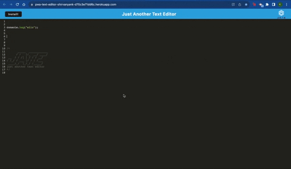

# PWA-Text-Editor

## Technology used
| Technology Used         | Resource URL           | 
| ------------- |:-------------:| 
| Deployed Application  | [https://pwa-text-editor-shirvanyank-d70c3e71dd6c.herokuapp.com/](https://pwa-text-editor-shirvanyank-d70c3e71dd6c.herokuapp.com/) |
| My Repository      | [https://github.com/ShirvanyanKaren/PWA-Text-Editor](https://github.com/ShirvanyanKaren/PWA-Text-Editor) |
| Express JS | [https://expressjs.com/en/4x/api.html#express.router](https://expressjs.com/en/4x/api.html#express.router) |
| Web Pack  | [https://webpack.js.org/concepts/](https://webpack.js.org/concepts/) |
| Manifest | [https://developer.chrome.com/docs/workbox/#injectmanifest_plugin](https://developer.chrome.com/docs/workbox/#injectmanifest_plugin) |
| Nodemon  | [https://www.npmjs.com/package/nodemon](https://www.npmjs.com/package/nodemon) |
| Concurrently  | [https://www.npmjs.com/package/concurrently](https://www.npmjs.com/package/concurrently) |
| Git | [https://git-scm.com/](https://git-scm.com/)     | 


# Description

Just Another Text Editor, or J.A.T.E. for short allows a user to take notes on an application and save it via the usage of a service worker for asset caching and IndexDB for storing the values. The PWA enables the user to create notes or code snippets and retrieve them without having to be connected to the internet with an optional install button to save the PWA. 


The application had to meet the following acceptance criteria:

```md
GIVEN a text editor web application
WHEN I open my application in my editor
THEN I should see a client server folder structure
WHEN I run `npm run start` from the root directory
THEN I find that my application should start up the backend and serve the client
WHEN I run the text editor application from my terminal
THEN I find that my JavaScript files have been bundled using webpack
WHEN I run my webpack plugins
THEN I find that I have a generated HTML file, service worker, and a manifest file
WHEN I use next-gen JavaScript in my application
THEN I find that the text editor still functions in the browser without errors
WHEN I open the text editor
THEN I find that IndexedDB has immediately created a database storage
WHEN I enter content and subsequently click off of the DOM window
THEN I find that the content in the text editor has been saved with IndexedDB
WHEN I reopen the text editor after closing it
THEN I find that the content in the text editor has been retrieved from our IndexedDB
WHEN I click on the Install button
THEN I download my web application as an icon on my desktop
WHEN I load my web application
THEN I should have a registered service worker using workbox
WHEN I register a service worker
THEN I should have my static assets pre cached upon loading along with subsequent pages and static assets
WHEN I deploy to Heroku
THEN I should have proper build scripts for a webpack application
```


Here is an example of how the application runs:




## Table of Contents
* [J.A.T.E.](#jate)
* [Usage](#usage)
* [License](#license)
* [Questions](#questions) 


## J.A.T.E.

The creation of J.A.T.E. integrated webpack and it's various packages like webpack-dev-server, manifest, and workbox-webpack-plugin. Other packages such as babel and mini-css-extract-plugin were also integrated to allow compatability with the browser and load styling content. 

```json
"author": "2U",
  "license": "UNLICENSED",
  "devDependencies": {
    "@babel/core": "^7.15.0",
    "@babel/plugin-transform-runtime": "^7.15.0",
    "@babel/plugin-proposal-object-rest-spread": "^7.20.7",
    "@babel/preset-env": "^7.15.0",
    "@babel/runtime": "^7.15.3",
    "babel-loader": "^8.2.2",
    "css-loader": "^6.2.0",
    "html-webpack-plugin": "^5.3.2",
    "http-server": "^0.11.1",
    "mini-css-extract-plugin": "^2.4.5",
    "style-loader": "^3.2.1",
    "webpack": "^5.51.1",
    "webpack-cli": "^4.8.0",
    "webpack-dev-server": "^4.0.0",
    "webpack-pwa-manifest": "^4.3.0",
    "workbox-webpack-plugin": "^6.2.4"
  },

```

### Webpack config

The webpack config file is essentially what allows us to bundle and create this PWA text editor by providing entry points to our src folder of assets, provide an output for the dist folder of the app, and enable access to the service worker for caching our assets.

 ```js
 module.exports = () => {
  return {
 mode: 'development',
    entry: {
      main: './src/js/index.js',
      install: './src/js/install.js'
    },
    output: {
      filename: '[name].bundle.js',
      path: path.resolve(__dirname, 'dist'),
    },
    plugins: [
      new HtmlWebpackPlugin({
        template: './index.html',
        title: 'PWA App'
      }),
      new MiniCssExtractPlugin(),
      new InjectManifest({
        swSrc: './src-sw.js',
        swDest: 'src-sw.js',
      }), 
      new WebpackPwaManifest({
        fingerprints: false,
        name: 'PWA App',
        short_name: 'PWA App',
        description: 'Challenge for PWA Text Editor',
        background_color: '#2224a3',
        theme_color: '#2224a3',
        start_url: '/',
        publicPath: '/',
        icons: [
          {
            src: path.resolve('src/images/logo.png'),
            sizes: [96, 128, 192, 256, 384, 512],
            destination: path.join('assets', 'icons'),
          },
        ],
      })
    ],

  }

 }
```


### Service Worker

A service worker is a script that runs in the background of a web application and can intercept and cache network requests, enabling offline functionality and improving performance.

The first registerRoute is intercepting requests with request.mode === 'navigate', which typically represent navigation requests. It is caching these requests using the pageCache strategy to provide offline access to the page.

```js
registerRoute(({ request }) => request.mode === 'navigate', pageCache);
```

The second registerRoute is intercepting various asset requests (styles, scripts, workers) based on request.destination. It uses the StaleWhileRevalidate strategy to serve assets from cache if available (stale), while also attempting to update the cache in the background (revalidate) for future use.

```js
registerRoute(
  ({ request }) => {
    console.log(request);
    return (
      request.destination === 'style' ||
      request.destination === 'script' ||
      request.destination === 'worker'
    );
  },
  new StaleWhileRevalidate({
    cacheName: 'asset-cache',
    plugins: [
      new CacheableResponsePlugin({
        statuses: [0, 200],
      }),
    ],
  })
);
```


## Usage

1. To use simply visit the deployed site at [Deployed Site](https://pwa-text-editor-shirvanyank-d70c3e71dd6c.herokuapp.com/)

2. Type whatever notes you want to the application that will be stored and updated in the IndexDB

3. If you want to run the application outside of your current browser, click the install button on the top left


## License 
     
MIT licensing with permisions such as commercial use, modification, distribution and private use. Limitations include liability and warranty.

## Questions 

* Check out my other projects on my [my Github](https://github.com/ShirvanyanKaren)
* For any additional questions or concerns, please email me at kshirvanyan2000@gmail.com